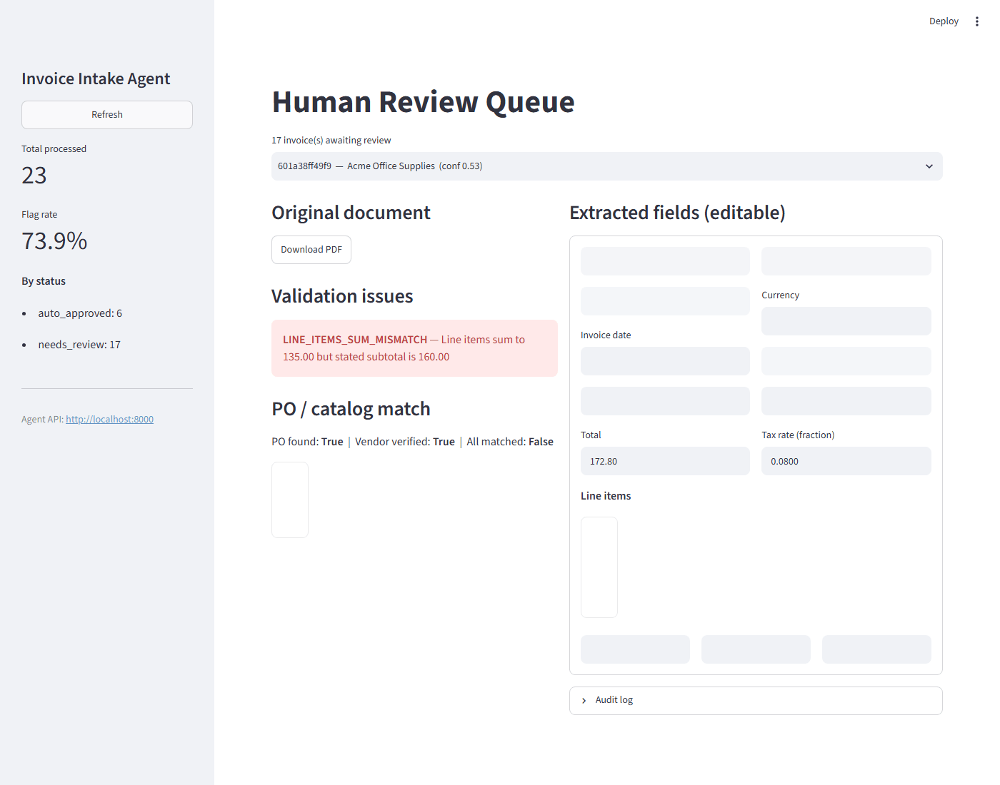

# InvoiceFlow

A 6-node LangGraph agent that ingests invoices (PDF/image), extracts and validates their data, reconciles against purchase orders in a mock ERP via real MCP tool calls, and routes anything uncertain to a human reviewer.




## How it works

```
intake (OCR) → classification (LLM) → extraction (LLM) → validation (rules + PO lookup)
             → matching (MCP: lookup_po / lookup_vendor / get_catalog_item)
             → human_review → auto-approve, or interrupt() and wait for a person
```

MCP server runs as a genuinely separate process (stdio or SSE), not an in-process function call. `human_review` uses LangGraph's native `interrupt()` — the run actually pauses, persisted via SQLite, and resumes exactly where it left off once a human decides.

## Results

- All 21 purpose-built test cases (5 clean, 16 deliberately malformed) → **21/21 correct reason codes**.
- **Harness bug found and fixed:** an earlier version of this harness reported 16 of those 21 as FAIL. Root cause: it looked for an `__interrupt__` key in the `ainvoke()` result, which only exists in newer LangGraph releases, so on older ones every paused run looked finished. The API had the same flaw (its review queue and resume flow rely on it). Both now read the checkpointed state (`agent.graph.pending_review`), and the harness reports a real **21/21** through the real MCP server over stdio.
- **97 automated tests, 88% line coverage** (CI fails below 80%): validation and matching rules, the end-to-end graph with auto-approve / approve / edit / reject paths, every FastAPI endpoint, intake branches, the output store, the MCP catalog tools, and the hardening below (retries, fallback, tracing, injection and tool-policy tests). The model code path is tested with stand-in chat models only; it has never been run against a live provider in CI, and the 21-case harness uses the offline heuristic parser.

## Production hardening

**Observability.** Every run produces an OpenTelemetry span tree: one span per graph node, per model call (`gen_ai.*` attributes: model, input/output tokens, cost) and per MCP tool call. `GET /traces/{invoice_id}` returns it with a summary (pipeline ms, tokens, cost, errors). Set `OTEL_EXPORTER_OTLP_ENDPOINT` to ship the same spans to Langfuse, Jaeger or Tempo (the OTLP export is not exercised in CI). Cost is computed from a small price table that you can override (`LLM_PRICES_JSON`); a model without a known price is reported as unpriced, never guessed. With no API key the "model" is the heuristic parser, which costs 0 and is labelled `heuristic`.

**Reliability.** Every outside call runs under a timeout, retries transient failures with jittered backoff, and sits behind a per-dependency circuit breaker (`GET /health/dependencies`). Failures are classified (timeout, rate limit, unavailable, invalid output, policy). If the first chat model fails the next one in the chain answers; if all fail, the heuristic parser runs, confidence is capped, and a `DEGRADED_PIPELINE` issue forces human review. If the ERP/catalog tools fail for good, the invoice gets a `PO_CHECK_FAILED` issue and goes to review instead of returning a 500. The graph has no loops, so there is no runaway-iteration case. [Failure-injection results](docs/reliability_eval.md): across 420 runs with 10–100% injected faults, 0 crashes and 0 unsafe approvals; the price of failing safe is that clean invoices go to a person when a dependency stays down (12% of them at a 30% fault rate).

**Security.** The invoice is attacker-controlled text, so: it is scanned for instruction-like content (override, role hijack, forced approval, skipped checks, tool abuse, hidden Unicode), cleaned of invisible characters, fenced in the prompt as untrusted data, and anything suspicious raises `PROMPT_INJECTION_SUSPECTED` and goes to a human. The scanner is a tripwire, not the control: the model has no tools, and auto-approval requires every deterministic check (arithmetic, PO, vendor, line items) to pass, so even a model that reports confidence 1.0 cannot approve a mismatched invoice (tested). MCP calls pass an allowlist with per-argument shape checks (SQL fragments, path traversal, extra or missing arguments are refused before reaching the server), non-object results are rejected, a server missing a required tool is refused, and every call - allowed, refused or failed - is written to an append-only audit log (`GET /audit/tools`). Set `API_KEY` to require an `X-API-Key` header on every route except the health check; the review/approve endpoints are otherwise open, so do not expose the API without it. Limits: the pattern list will miss novel phrasings and will flag some legitimate notes (which only costs a human glance); there is no per-user identity or role separation, only the shared key.

## Run it

```bash
pip install -r requirements.txt
python mcp_server/db.py                          # seed mock ERP
python test_invoices/generate_test_invoices.py    # generate the 21 test cases
python test_invoices/run_tests.py                 # run them end-to-end, no server needed
```

Full stack (API + dashboard + n8n):
```bash
docker compose up --build
# API: localhost:8000 · Dashboard: localhost:8501 · n8n: localhost:5678
```

No API key needed — classification/extraction fall back to a deterministic offline parser. Set `ANTHROPIC_API_KEY` or `OPENAI_API_KEY` for the real LLM path.

## Use the MCP server with Claude Desktop

The ERP lookup server is a standalone MCP server, so any MCP client can use it, not just this agent. To give Claude Desktop the three tools (`lookup_po`, `lookup_vendor`, `get_catalog_item`), add this to `claude_desktop_config.json` (Settings → Developer → Edit Config) and restart Claude:

```json
{
  "mcpServers": {
    "invoice-catalog": {
      "command": "python",
      "args": ["/absolute/path/to/InvoiceFlow/mcp_server/server.py"]
    }
  }
}
```

Then ask Claude things like *"Is PO-1001 still open, and what's its total?"* and it answers from the ERP database through the tools. The database seeds itself on first start.

Check it works without Claude (spawns the server over stdio the same way Claude does, lists the tools, calls one):
```bash
python mcp_server/smoke_test.py
```

Full architecture diagram, all 21 test cases, and MCP server details in [`docs/DETAILS.md`](docs/DETAILS.md).
